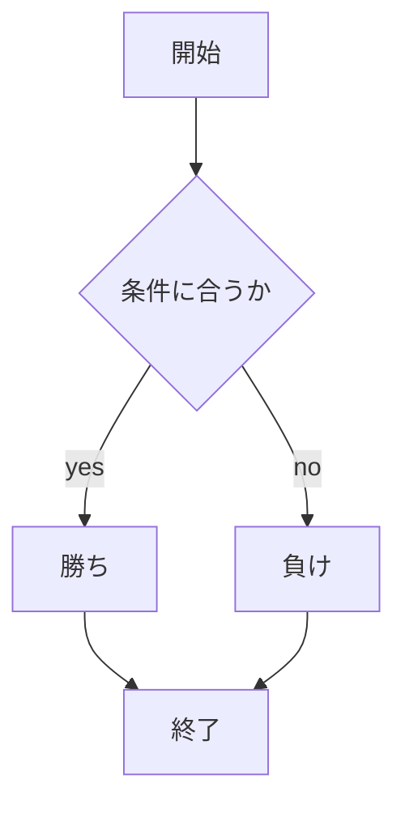

# webpro_06
## このプログラムについて
## ファイル一覧
ファイル名|説明
-|-
app5.js | プログラム本体
public/janken.html | じゃんけんの開始画面
views/janken.ejs | じゃんけんのテンプレートファイル

<!-- ```で書こうとソースコードを書ける
```javascript
console.log('Hello')
``` -->

<!-- 項目の中にいれると良い -->
### 使用方法
1. `node app5.js`でapp5.jsを起動する
2. webブラウザでlocalhost:8080/public/janken.htmlにアクセスする
3. 自分が出したい手を入力する



