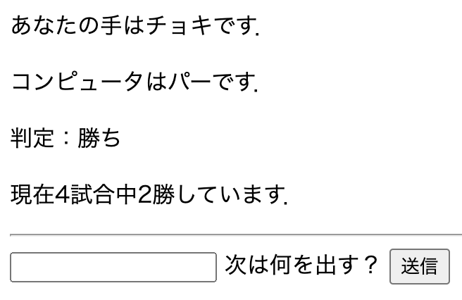
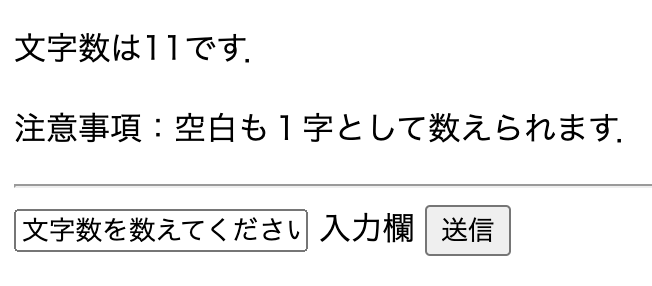

# webpro_06
## app5.js
## ファイル一覧
ファイル名|説明
-|-
app5.js | プログラム本体
public/janken.html | じゃんけんの開始画面
public/length.html | 文字数計測の開始画面
views/icon.ejs | アイコン表示のテンプレートファイル
views/show.ejs | 文字列表示のテンプレートファイル
views/luck.ejs | おみくじのテンプレートファイル
views/janken.ejs | じゃんけんのテンプレートファイル
views/length.ejs | 文字数計測のテンプレートファイル


## じゃんけん
### 使用ファイル
ファイル名|説明
-|-
app5.js | プログラム本体
public/janken.html | じゃんけんの開始画面
views/janken.ejs | じゃんけんのテンプレートファイル
<!-- ```で書くとソースコードを書ける
```javascript
console.log('Hello')
``` -->

<!-- 項目の中にいれると良い -->
### 使用方法
1. `node app5.js`でapp5.jsを起動する
2. webブラウザで`http://localhost:8080/public/janken`にアクセスする
3. 自分が出したい手を入力する
4. 送信ボタンを押すと勝敗判定と勝負数，勝ちの回数が表示される

### 使用例

## 文字数計測
### 使用ファイル
ファイル名|説明
-|-
app5.js | プログラム本体
public/length.html | 文字数計測の開始画面
views/length.ejs | 文字数計測のテンプレートファイル

###　使用方法
1. `node app5.js`でapp5.jsを起動する
2. webブラウザで`http://localhost:8080/public/length`にアクセスする
3. 文字を入力する(空白も１字として数えられるので注意)
4. 送信ボタンを押すと文字数が数えられる
### 使用例
