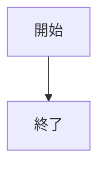
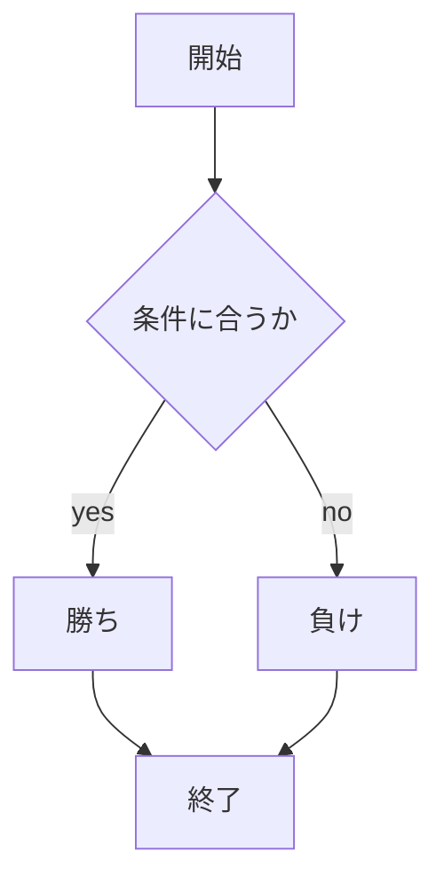
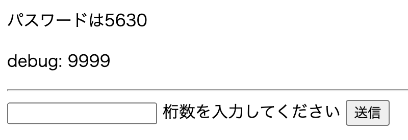

# webpro_06
## app5.js
アイコンや文字列の表示，乱数を使ったおみくじ，コンピュータとじゃんけん，文字数計測，べき乗の計算，パスワードの生成が可能．
## ファイル一覧
ファイル名|説明
-|-
app5.js | プログラム本体
public/janken.html | じゃんけんの開始画面
public/length.html | 文字数計測の開始画面
public/exponentiation | べき乗計算の開始画面
public/pass.html | パスワード生成の開始画面
views/icon.ejs | アイコン表示のテンプレートファイル
views/show.ejs | 文字列表示のテンプレートファイル
views/luck.ejs | おみくじのテンプレートファイル
views/janken.ejs | じゃんけんのテンプレートファイル
views/length.ejs | 文字数計測のテンプレートファイル
views/exponentiation | べき乗計算のテンプレートファイル
views/pass.ejs | パスワード生成のテンプレートファイル
2024-11-18-11-53-44.png | おみくじの使用例画像
2024-11-18-00-13-49.png | じゃんけんの使用例画像
2024-11-18-00-15-24.png | 文字数計測の使用例画像
2024-11-18-21-38-09.png | べき乗計算の使用例画像
2024-11-18-21-58-11.png | パスワード生成の使用例画像

## フローチャート
### フローチャート1

### フローチャート2

## おみくじ
乱数を用いたおみくじを引くことができる．1~6の実数の乱数のうち1.0未満で大吉，4.0未満で吉，4.8未満で中吉，5.3未満で小吉，5.8未満で末吉，5.9未満で凶が出力される．

### 使用ファイル
ファイル名|説明
-|-
app5.js | プログラム本体
views/luck.ejs | おみくじのテンプレートファイル

### 使用方法
1. 1. `node app5.js`でapp5.jsを起動する
2. webブラウザで`http://localhost:8080/luck`にアクセスする
3. アクセスするとおみくじの結果と生成した乱数が表示される
4. リロードするたびにおみくじを引ける

### 使用例

## じゃんけん
ユーザが入力した手でコンピュータとじゃんけんをし，勝敗判定と勝負数，勝ちの回数を表示する
### 使用ファイル
ファイル名|説明
-|-
app5.js | プログラム本体
public/janken.html | じゃんけんの開始画面
views/janken.ejs | じゃんけんのテンプレートファイル

### 使用方法
1. `node app5.js`でapp5.jsを起動する
2. webブラウザで`http://localhost:8080/public/janken.html`にアクセスする
3. 自分が出したい手を入力する
4. 送信ボタンを押すと勝敗判定と勝負数，勝ちの回数が表示される

### 使用例

## 文字数計測
任意の文字を入力し，その文字数を返す．
### 使用ファイル
ファイル名|説明
-|-
app5.js | プログラム本体
public/length.html | 文字数計測の開始画面
views/length.ejs | 文字数計測のテンプレートファイル

###　使用方法
1. `node app5.js`でapp5.jsを起動する
2. webブラウザで`http://localhost:8080/public/length.html`にアクセスする
3. 文字を入力する(空白も１字として数えられるので注意)
4. 送信ボタンを押すと文字数が数えられる
### 使用例

## べき乗計算
例えば"2の10乗"といったように任意の底と指数を入力し，そのべき乗を返す．

### 使用ファイル
ファイル名|説明
-|-
app5.js | プログラム本体
public/exponentiation.html | べき乗計算の開始画面
views/exponentiation.ejs | べき乗計算のテンプレートファイル

### 使用方法
1. `node app5.js`でapp5.jsを起動する
2. webブラウザで`http://localhost:8080/public/exopnentiation.html`にアクセスする
3. 底と指数を入力する
4. 送信ボタンを押すとべき乗が計算される

### 使用例

## パスワード生成
乱数を用いて任意の桁数の数を表示する．

### 使用ファイル
ファイル名|説明
-|-
app5.js | プログラム本体
public/pass.html | パスワード生成の開始画面
views/pass.ejs | パスワード生成のテンプレートファイル

### 使用方法
1. `node app5.js`でapp5.jsを起動する
2. webブラウザで`http://localhost:8080/public/pass.html`にアクセスする
3. 任意の桁数を入力する
4. 送信ボタンを押すとその桁数で乱数が生成される

### 使用例
